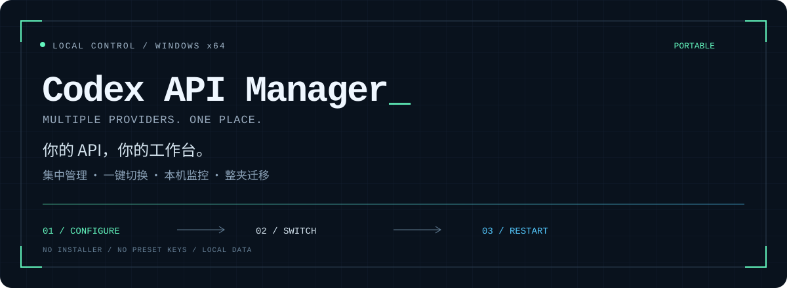
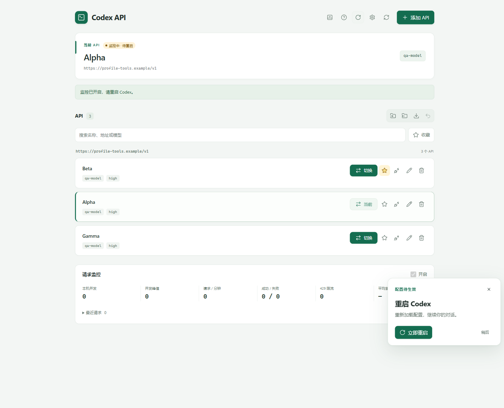

<p align="center">
  
</p>

<p align="center">
  <a href="https://github.com/liangc001/codex-api-manager/releases/latest"></a>
  
  
  
</p>

<p align="center">
  <strong>把散落在不同服务商的 URL 和 Key，收进一个桌面工具。</strong><br>
  按地址分组、切换 Codex 连接、查看支持的用量数据。双击即用，配置随文件夹迁移。
</p>

<p align="center">
  <a href="https://github.com/liangc001/codex-api-manager/releases/latest"><strong>↓ 下载 Windows 便携版</strong></a> &nbsp; · &nbsp;
  <a href="#三步开始">快速开始</a> &nbsp; · &nbsp;
  <a href="docs/guide.md">完整使用指南</a> &nbsp; · &nbsp;
  <a href="https://github.com/liangc001/codex-api-manager/issues">反馈问题</a>
</p>

---

## 一个工作台，管理所有连接



<sub>实际软件界面，使用虚构的示例地址与账号；不附带服务商或 Key。</sub>

| 能力 | 你可以做什么 |
| :--- | :--- |
| **多 API 管理** | 按 URL 自动分组，同地址下的不同 Key 独立保存、编辑和切换。 |
| **一键切换** | 更新本机 Codex 默认连接；兼容的旧对话服务商地址一起同步。 |
| **重启桌面 App** | 点击按钮重新打开 Codex，让配置生效；支持手动重启状态核对。 |
| **模型查询与托盘** | 查询并选择服务商模型；托盘菜单直接切换 API、重启 Codex、打开主窗口。 |
| **用量与连接测试** | 勾选批量刷新并记住选择，查询服务商支持的余额、额度或累计用量；确认后可发送“你好”测试连接。 |
| **本机请求监控** | 查看经过本机代理的并发、请求状态、限流次数和耗时。 |
| **配置分享** | 导入配置，或选择部分 API 导出，Key 一起携带。 |
| **便携与恢复** | 数据放在 EXE 旁，支持加密备份与撤销切换，无需重新安装工具。 |
| **新手引导** | 悬浮教程联动实际按钮，走完添加、切换、重启；随时退出。 |
| **一键更新** | 自动检查 GitHub Releases，提示新版；校验下载文件后更新并重启工具，保留配置。 |

## 三步开始

**01 · 下载并启动**<br>
在 [Releases](https://github.com/liangc001/codex-api-manager/releases/latest) 下载 `.exe`，放进有写入权限的文件夹后双击。无需安装 Node.js，也无需打开浏览器。

**02 · 添加你的 API**<br>
填写服务商的地址和 Key，查询模型后选择，或手动填写模型。首次启动列表为空，可跟随悬浮教程操作。

**03 · 切换并重新打开 Codex**<br>
点击 API 旁的“切换”，再点击“重启 Codex App”。CLI 用户手动重新打开 CLI。

> 需要电脑上已安装 Codex。桌面 App 与 CLI 需读取同一配置目录；环境变量、项目设置或启动参数可能覆盖默认连接。

## 带走工具，也带走配置

```text
Codex-API-Manager/
├── Codex-API-Manager.exe
└── data/
    ├── profiles.json     # API 列表与加密 Key
    ├── secrets.key       # 便携加密密钥
    ├── settings.json     # 软件设置
    ├── backups/          # 加密恢复备份
    ├── logs/             # 安全操作日志
    └── cache/            # 界面状态与缓存
```

| 场景 | 操作 |
| :--- | :--- |
| **升级版本** | 1.0.26 起点击“更新并重启”；旧版首次升级需手动替换 EXE，保留 `data`。 |
| **换自己的电脑** | 正常关闭工具，复制 EXE 和完整 `data`。在新电脑重新切换 API 并打开 Codex。 |
| **分享给朋友** | 只发 EXE，朋友自行添加配置。 |
| **分享指定账号** | 使用“导出 API”选择条目；导出的 JSON 包含明文 Key。 |

## 使用边界与密钥保护

- **数据保存在本地。** Key 与备份采用 AES-256-GCM 加密；拿到完整 `data` 文件夹的人仍能解密 Key。请勿公开个人 `data` 或配置导出文件。
- **用量取决于服务商。** 支持 New API、Sub2API 等接口；接口没有返回的信息不会凭空补齐。“累计使用”的时间范围由上游定义。
- **并发统计仅来自本机代理。** 无法查询服务商全账户并发或剩余可用并发。
- **测试连接会产生少量用量。** 操作前会确认；普通用量查询不发送付费模型请求。
- **旧对话兼容有范围。** 可同步使用全局 Key 的 Responses 服务商；独立认证、内置 OpenAI 服务商等不在此范围。工具不迁移聊天记录。
- **日志不保存 Key 或对话。** 诊断导出用于排查，排除 Key、名称、地址和个人路径；它与包含 Key 的配置导出是两种文件。

详细说明见 [使用指南](docs/guide.md)，包括存储位置、监控恢复、导入规则及配置覆盖排查。

## 从源码运行

Node.js 22+，Windows：

```powershell
npm ci
npm run desktop      # 启动桌面开发版
npm test             # 运行单元测试
npm run build:exe    # 构建 Windows x64 便携版
```

Electron · TOML · Lucide。源码开发的数据也保存在项目旁的 `data`，不加入版本控制，不打包进 EXE。

---

<p align="center">
  觉得有用？欢迎 Star，或通过 <a href="https://github.com/liangc001/codex-api-manager/issues">Issues</a> 提出建议。<br>
  <sub>独立社区工具，与 OpenAI 无隶属关系。</sub>
</p>
