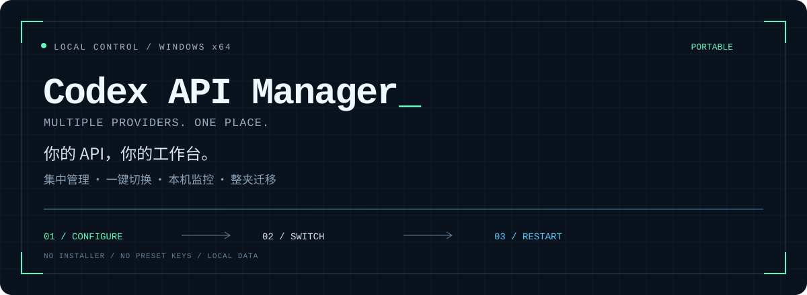
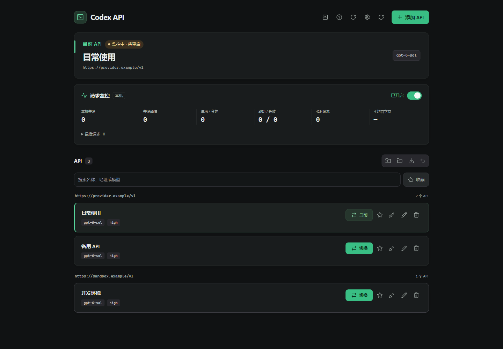
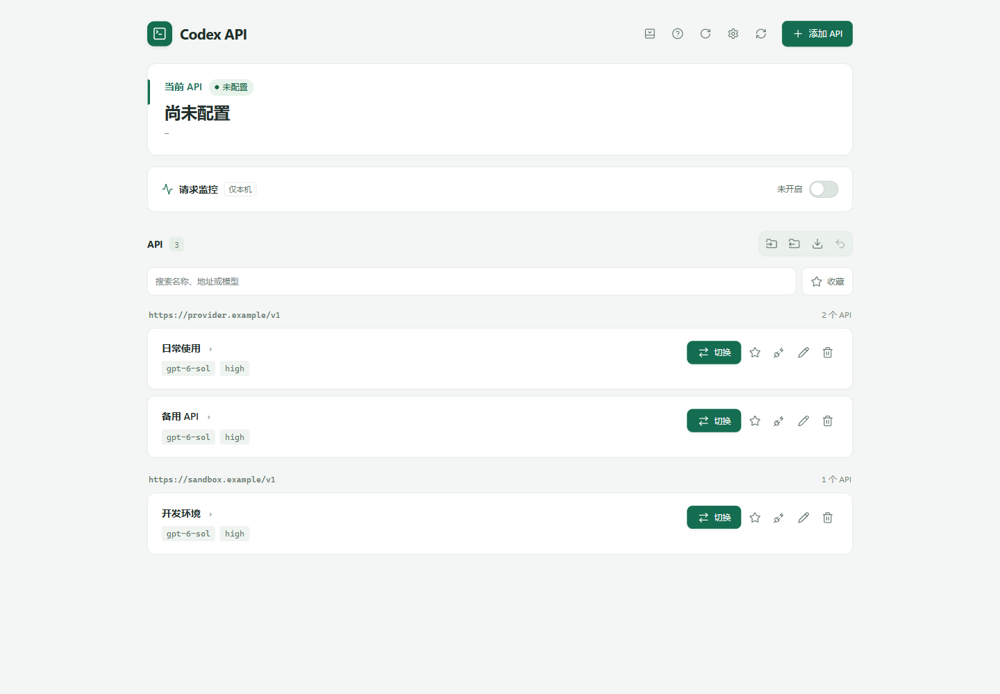

<p align="center">
  
</p>

<p align="center">
  <a href="https://github.com/liangc001/codex-api-manager/releases/latest"></a>
  
  
  
</p>

<p align="center">
  <strong>多个 Codex API，一个桌面工作台。</strong><br>
  管理 URL 与 Key，切换连接，重启 Codex，查看用量与本机请求。<br>
  Windows 便携工具 · 支持 Codex App 与 CLI · 首次启动无预置账号
</p>

<p align="center">
  <a href="https://github.com/liangc001/codex-api-manager/releases/latest/download/Codex-API-Manager.exe"></a>
</p>

<p align="center">
  <a href="#快速开始">快速开始</a> &nbsp; / &nbsp;
  <a href="docs/guide.md">使用指南</a> &nbsp; / &nbsp;
  <a href="https://github.com/liangc001/codex-api-manager/releases">更新记录</a> &nbsp; / &nbsp;
  <a href="https://github.com/liangc001/codex-api-manager/issues">反馈问题</a>
</p>

## 看一眼工作台



<sub>实际界面，使用虚构的示例地址和账号。黑灰底色、绿色高亮；也支持浅色与跟随系统。</sub>

<details>
<summary>查看浅色主题</summary>



在「设置 → 外观与更新 → 主题」切换。

</details>

## 适合这样的你

- **手里有多个服务商或 Key**：按地址分组，同一个 URL 下的不同 Key 分开保存；搜索、收藏快速找到常用连接，点击「详情」查看配置和用量。
- **经常切换 Codex 连接**：选中 API，一键写入配置，再重启 Codex App；CLI 重新打开即可加载。
- **想知道请求为什么失败**：连接测试、HTTP 状态、首字节等待与本机转发情况集中查看。
- **需要换电脑或分享配置**：软件与数据整夹迁移；也可选择部分 API 导出，Key 一起携带。

## 日常操作，集中完成

| 连接管理 | 用量与排查 | 使用体验 |
| :--- | :--- | :--- |
| 按 URL 分组，多 Key 独立保存 | 勾选批量刷新用量，记住选择 | 双击 EXE，无需安装 |
| 查询模型，选择或手动填写 | 查询上游支持的余额、额度和累计用量 | 浅色 / 深色 / 跟随系统 |
| 切换配置、撤销切换、重启 App | 确认后发送“你好”测试连接 | 托盘菜单切换 API 与重启 App |
| 点击「详情」查看配置和用量解释 | 本机并发、限流、请求状态与耗时 | 悬浮新手引导与更新提醒 |
| 导入配置、选择性导出（包含 Key） | 脱敏诊断导出，协助排查 | 检查新版、校验文件、一键更新 |

## 快速开始

**① 下载并启动**

[下载 Codex-API-Manager.exe](https://github.com/liangc001/codex-api-manager/releases/latest/download/Codex-API-Manager.exe)，放到有写入权限的文件夹，双击启动。无需安装 Node.js 或打开浏览器。

**② 添加 API**

填写名称、URL、Key 和模型。可以查询服务商模型，也可以导入已有配置。新用户可跟随引导完成操作。

**③ 切换，重新打开 Codex**

点击 API 旁的「切换」，再点击「重启 Codex App」。CLI 用户重新打开 CLI。

> 需已安装 Codex，并使用服务商支持的模型。App 与 CLI 需读取同一配置目录；环境变量、项目配置或启动参数可能覆盖默认连接。

## 换电脑、升级、分享

软件启动后，在 EXE 旁创建 `data` 文件夹。

| 你要做什么 | 怎么做 |
| :--- | :--- |
| **更新软件** | 设置中检查更新；手动升级时正常退出后替换 EXE，保留 `data`。 |
| **换自己的电脑** | 正常退出，复制 EXE 和完整 `data`；在新电脑重新切换 API，再打开 Codex。 |
| **发给朋友** | 只发 EXE，朋友自行配置。 |
| **分享指定 API** | 选择条目导出；文件包含明文 Key，只交给可信的人。 |

<details>
<summary>查看数据文件结构</summary>

```text
Codex-API-Manager/
├── Codex-API-Manager.exe
└── data/
    ├── profiles.json     # API 列表与加密 Key
    ├── secrets.key       # 便携加密密钥
    ├── settings.json     # 软件设置
    ├── backups/          # 加密恢复备份
    ├── logs/             # 操作日志
    └── cache/            # 界面状态与缓存
```

</details>

## 下载前，了解这几件事

**Key 存在本地，但完整数据文件夹仍需保护。** Key 与备份采用 AES-256-GCM 加密；拿到完整 `data` 的人仍可解密。日志不保存 Key 或对话，诊断导出排除 Key、名称、地址和个人路径。配置导出则包含明文 Key。

**用量信息以服务商返回为准。** 支持 New API、Sub2API 等接口，不保证所有服务商都可查询；“累计使用”的时间范围由上游定义。连接测试会产生少量用量，执行前会确认。

**监控仅统计经过本机代理的请求。** 不代表服务商总并发或剩余并发。开启、关闭后需重启 Codex；监控期间保持工具运行。退出时先恢复直连，并提示重启。

**旧对话兼容有范围。** 可同步使用全局 Key 的 Responses 服务商；独立认证和内置 OpenAI 服务商等不在此范围。工具不迁移聊天记录。

更多说明见 [使用指南](docs/guide.md)。

## 反馈与参与

遇到问题，请在 [Issues](https://github.com/liangc001/codex-api-manager/issues) 中说明软件版本、操作步骤和预期结果。可附「设置 → 问题排查」导出的诊断；**不要上传 Key、个人 data 文件夹或配置导出文件**。

觉得有用，欢迎 Star 或把下载链接分享给同样需要管理多个 API 的朋友。

<details>
<summary>从源码运行 / 构建</summary>

Windows，Node.js 22+：

```powershell
npm ci
npm run desktop      # 启动桌面开发版
npm test             # 运行单元测试
npm run build:exe    # 构建 Windows x64 便携版
```

Electron · TOML · Lucide。开发数据保存在项目旁的 `data`，不加入版本控制、不打包进 EXE。

</details>

---

<p align="center"><sub>独立社区工具，与 OpenAI 无隶属关系。</sub></p>
